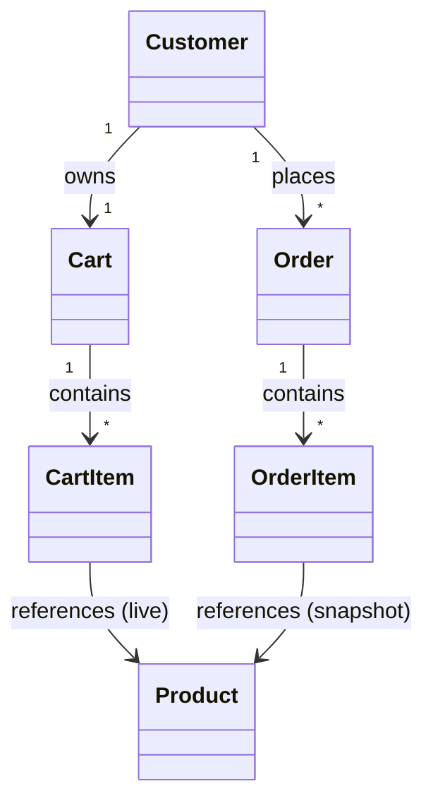
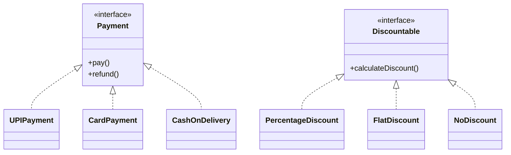
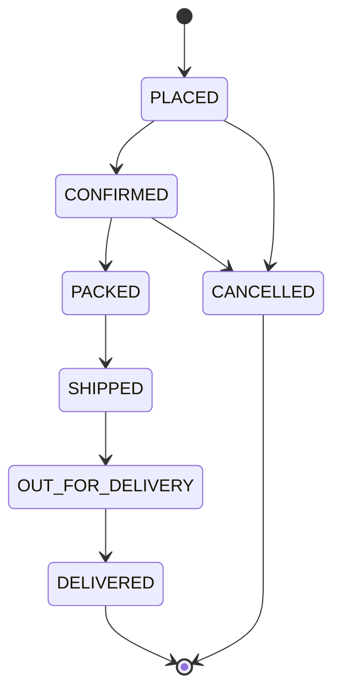
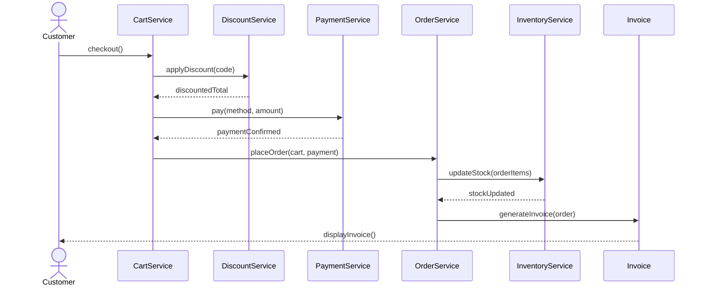
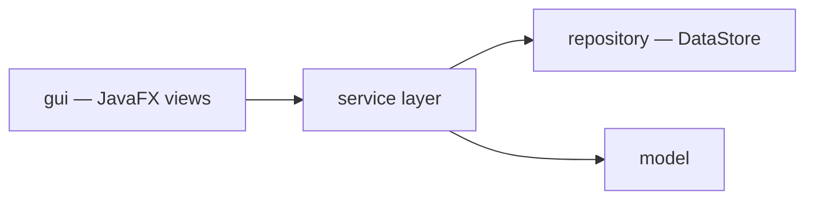

# 🏗️ EcomFlow — Architecture Document

This document expands on the architecture summarized in [`README.md`](./README.md), covering system modules, entity design, data storage strategy, and key workflows in more detail. It is intended as a companion reference for developers, reviewers, and viva evaluators.

---

## 1. Design Philosophy

EcomFlow is architected around two priorities, in order:

1. **Clarity of OOP demonstration** — every class exists to make a specific OOP concept visible and testable.
2. **Realistic layering** — despite being an academic project, the codebase follows a layered structure (`gui → service → model/repository`) so business logic never lives inside entity classes or GUI screens.

The result is a system that is small enough to fully understand in one sitting, but structured the way a real (if simplified) application would be.

---

## 2. System Modules

| # | Module | Responsibility |
|---|--------|-----------------|
| 1 | Authentication Module | Registration, login, logout, credential validation |
| 2 | User Management Module | Shared user identity/profile behavior (`User`, `Customer`, `Admin`) |
| 3 | Product Management Module | CRUD operations on products and product hierarchy |
| 4 | Category Management Module | Organizing products into categories |
| 5 | Inventory Management Module | Stock levels, stock rules, restock/deduct logic |
| 6 | Shopping Cart Module | Cart and cart-item lifecycle for a customer |
| 7 | Order Management Module | Order creation, status transitions, cancellation |
| 8 | Payment Module | Pluggable payment strategies (UPI, Card, COD) |
| 9 | Discount/Coupon Module | Pluggable discount strategies applied at checkout |
| 10 | Invoice Module | Generating and displaying a post-checkout invoice |
| 11 | Admin Module | Admin-only JavaFX GUI flows and operations |
| 12 | Customer Module | Customer-only JavaFX GUI flows and operations |

Each module maps to one or more classes in the `model`, `service`, `payment`, or `discount` packages — there is a deliberate 1:1 traceability between "module" (a functional concern) and "package/class" (a code artifact).

---

## 3. Entity Design Notes

### 3.1 `User` (abstract base identity)

| Field | Type | Notes |
|-------|------|-------|
| `userId` | `int` | Assigned via a static counter |
| `name` | `String` | |
| `email` | `String` | Must be unique — enforced by `AuthenticationService` |
| `password` | `String` | Plain-text for this academic version (see §6) |
| `phone` | `String` | |

`Customer` and `Admin` both extend `User`, inheriting `login()`, `logout()`, and `displayProfile()`, while overriding behavior where role-specific formatting or logic is required.

### 3.2 `Product` (abstract hierarchy root)

`Product` is declared `abstract` and defines `calculateDiscount()` as an abstract method — every concrete product type must supply its own pricing/discount behavior, which is the project's clearest demonstration of **abstraction**.

```
Product (abstract)
 ├── Electronics   (brand, warranty)
 ├── Clothing      (size, material)
 └── Grocery       (expiryDate)
```

### 3.3 Cart & Order — Parallel Composition Structures

`Cart`/`CartItem` and `Order`/`OrderItem` are intentionally parallel structures:

- `Cart` holds *current, mutable* shopping state tied to one `Customer`.
- `Order` holds an *immutable snapshot* of that state at the moment of checkout (price, quantity, and product reference are frozen at order time).

This separation avoids a common design bug where changing a product's price retroactively changes the total of a past order.



---

## 4. Payment & Discount: Strategy-Style Design

Both the payment and discount modules follow the same pattern: **define behavior via an interface, then supply multiple interchangeable implementations.**



This design means `CartService`/`OrderService` never need to know *which* payment or discount implementation is active — they simply call `payment.pay()` or `discount.calculateDiscount()` through the interface type. New strategies (e.g., a future `WalletPayment`) can be added without modifying existing checkout logic — an example of the **Open/Closed Principle** in practice, built entirely from interfaces and polymorphism.

---

## 5. Data Storage Strategy (Version 1)

EcomFlow uses **in-memory Java Collections** instead of a database for Version 1. This keeps the project focused on OOP fundamentals rather than persistence/JDBC concerns, while still requiring thoughtful data-structure choices.

| Collection | Used For | Why |
|------------|----------|-----|
| `ArrayList<Product>` | Product catalog, cart items, order items | Ordered, allows duplicates, fast iteration for listing/searching |
| `ArrayList<Order>` | Order history per customer | Preserves chronological order of placement |
| `HashMap<String, User>` | User lookup by email during login | O(1) average lookup by unique key (email) |
| `HashMap<Integer, Product>` | Product lookup by ID | O(1) average lookup for cart/order operations |
| `HashSet<String>` | Enforcing unique category names / unique emails | Automatic duplicate rejection |

`DataStore` (in the `repository` package) centralizes these collections so services never manage raw collections directly — this keeps the storage mechanism swappable (e.g., for a future JDBC-backed repository) without touching business logic.

> 🔮 **Future Enhancement:** Replace `DataStore` with a JDBC-backed repository implementation behind the same interface, enabling persistent storage without changing the service layer.

---

## 6. Authentication Design (Academic Scope)

`AuthenticationService` handles registration, login, logout, and credential validation with the following rules:

- Email must be unique across all registered users.
- Password must not be empty.
- An invalid login attempt returns a clear failure message (via `InvalidLoginException`) rather than a raw stack trace.

**Admin-initiated account deletion:** `AuthenticationService` (or `AdminService`, delegating to it) also exposes a `deleteCustomer(...)` operation, callable only from the Admin Dashboard's Customers screen. Deleting a customer removes their `User`/`Customer` record and frees their email for re-registration, but deliberately does **not** cascade-delete their past `Order` records — order history is treated as a business record that outlives the account that created it, consistent with how `Order`/`OrderItem` already snapshot data independently of live references (see §3.3). The GUI requires an explicit confirmation step before calling this method, since it's destructive and irreversible.

> ⚠️ **Scope note:** This is a JavaFX-based academic project. Passwords are stored as plain strings for simplicity and are **not** intended to represent production-grade security practice. Hashing, salting, and real authentication mechanisms are explicitly out of scope for Version 1 and are listed under Future Enhancements.

---

## 7. Order Lifecycle



Rules enforced by `OrderService` / `InventoryService`:

- Inventory is deducted automatically the moment an order is successfully placed.
- If an order is cancelled **before** delivery, the reserved stock is restored to inventory.
- A `DELIVERED` order cannot be cancelled — enforced in `Order.cancelOrder()`, throwing an appropriate exception if attempted.
- Stock can never go negative — `InventoryService.removeStock()` validates availability before deduction.

---

## 8. Checkout Sequence



---

## 9. Exception Handling Strategy

Custom checked/unchecked exceptions represent domain failures explicitly rather than relying on generic `RuntimeException` or unchecked `null` behavior:

| Exception | Thrown When |
|-----------|-------------|
| `InvalidLoginException` | Login credentials do not match any registered user |
| `ProductNotFoundException` | A lookup by product ID/name finds no match |
| `InsufficientStockException` | Requested order quantity exceeds available stock |
| `EmptyCartException` | Checkout is attempted on an empty cart |
| `InvalidPaymentException` | An unsupported or malformed payment request is made |

Each service method that can fail declares `throws` accordingly, and the `gui` layer wraps calls in `try/catch` blocks to present clean, user-facing dialog messages (JavaFX `Alert`) instead of raw stack traces.

---

## 10. Package Responsibility Matrix

| Package | Contains | Should NOT Contain |
|---------|----------|---------------------|
| `model` | Entity state + entity-level behavior (`displayDetails()`, `calculateSubtotal()`) | Business workflows, GUI I/O |
| `interfaces` | Contracts (`Payment`, `Discountable`) | Implementation logic |
| `payment` / `discount` | Concrete strategy implementations | Order/cart orchestration |
| `service` | Business logic, validation, orchestration across models | JavaFX imports, raw collections |
| `repository` | In-memory data storage (`DataStore`) | Business rules |
| `enums` | Fixed constant sets (`OrderStatus`, `PaymentStatus`) | Behavior/logic |
| `gui` | JavaFX views/controllers, input/output, calling services | Business logic, direct data manipulation, direct `DataStore` access |

This matrix is the guiding rule used throughout development to keep each class's responsibility single and clear (Single Responsibility Principle).

---

## 11. Presentation Layer: JavaFX GUI (`gui`)

EcomFlow's presentation layer is a JavaFX desktop interface (`MainApp`, `LandingView`, `LoginView`, `RegisterView`, `CustomerDashboardView`, `AdminDashboardView`) sitting directly on top of `service`. `LandingView` is the app's actual first screen — authentication is reached only by clicking through from it, not launched directly.

The `gui` package never talks to `repository` or `model` business rules directly — it only calls `service` classes (`AuthenticationService`, `CartService`, `OrderService`, etc.), which is what keeps the layering clean and lets the presentation mechanism be swapped later without touching business logic:



**Design rules for `gui`:**

- Every JavaFX event handler (a button's `setOnAction`, a `TableView` cell edit, and so on) does exactly one thing: gather input from the form/control, call a `service` method, and render the result or catch a thrown exception into a JavaFX `Alert` dialog — no validation or business logic lives in the handler itself. The Admin Customers screen's delete-account button follows the same pattern, plus a confirmation `Alert` before the destructive call is made.
- `MainApp` owns a single `Stage` and swaps its root `Scene`/`Node` to move between Landing, Login, Register, Customer Dashboard, and Admin Dashboard, via a shared `switchSceneWithFade(Node)` helper rather than an instant swap — every navigation transition fades out the old root and fades in the new one, so screen changes read as deliberate rather than jarring.
- All screens share one stylesheet (`resources/css/styles.css`), applied once via `scene.getStylesheets().add(...)` per screen, so visual language stays centralized rather than hardcoded per component with inline `-fx-style` strings. The stylesheet encodes **two coordinated themes** — dark (`--bg-dark`/`--surface-dark`/`--text-light`) for Landing/Login/Register, light (`--bg-light`/`--text-dark`) for the Dashboards — sharing the same `--accent` color and font so the app still reads as one coherent product across both.
- The Sora font family is bundled as `.ttf` files under `resources/fonts/` and explicitly loaded via `Font.loadFont(...)` in `MainApp.init()` for each weight used, rather than relying on it being installed system-wide — necessary because, unlike a browser, JavaFX has no automatic web-font fallback.
- `AnimatedGradientBackground` is a small reusable class (not CSS) implementing the animated, slowly-shifting gradient used behind `LandingView`'s hero and the Auth screens' side panel — built with a looping `Timeline` interpolating background gradient stops, since JavaFX CSS has no `@keyframes` equivalent. `LandingView`'s radiating-ring visual is built the same way in principle: several `Circle` nodes, each independently animated with a staggered, looping `ScaleTransition` + `FadeTransition` pair, rather than any CSS-only trick.
- Product images are loaded once via `GuiUtils` helper methods (e.g., `loadImage(String filename)`) into `ImageView` nodes, keeping file-path/resource-loading logic out of individual view classes.
- Long-running work (there is none yet, since everything is in-memory) would be moved off the JavaFX Application Thread using a `Task`/`Service`, with results applied back on the UI thread via `Platform.runLater`.
- `CaptureScreenshots.java` (in the `com.ecomflow` root package, not `gui`) is a separate dev-only `Application` subclass that renders each `gui` screen headlessly and writes a snapshot to `resources/images/screenshots/`. It depends on the `javafx.swing` module (for `SwingFXUtils`) and is compiled/run independently from the main app — see the file's own header comment for the exact commands. It builds its own temporary demo data (a registered Customer, sample cart/order) rather than depending on any particular seeded state, so it keeps working even if the seed data in `Main`/`MainApp` changes later.

This mirrors the same Strategy-style thinking used for `Payment`/`Discountable` in §4: the presentation mechanism sits behind a stable layer boundary, so a future web frontend (see README's Future Enhancements) could be added the same way, without touching `service`, `model`, or `repository`.

---

## 12. Summary

EcomFlow's architecture is deliberately simple in scope but disciplined in structure. Every design decision — the abstract `Product` hierarchy, the strategy-based `Payment`/`Discountable` interfaces, the separation of `Cart` from `Order`, the layered package structure, and the JavaFX `gui` layer with its centralized CSS styling sitting cleanly on top of `service` — exists to give a concrete, working example of a specific Java OOP concept, while still resembling how a real application would be organized.

For the full feature list, JavaFX UI design, and setup instructions, see [`README.md`](./README.md).
