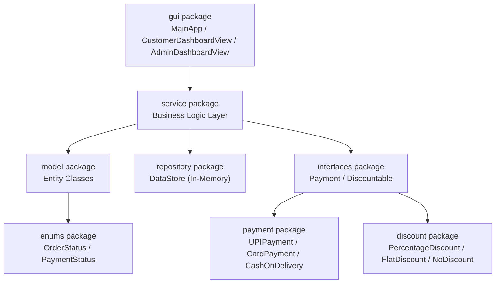
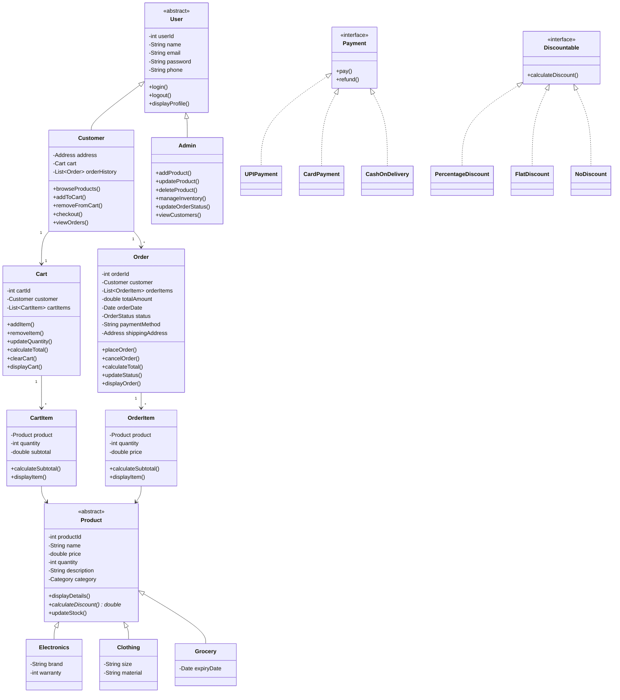
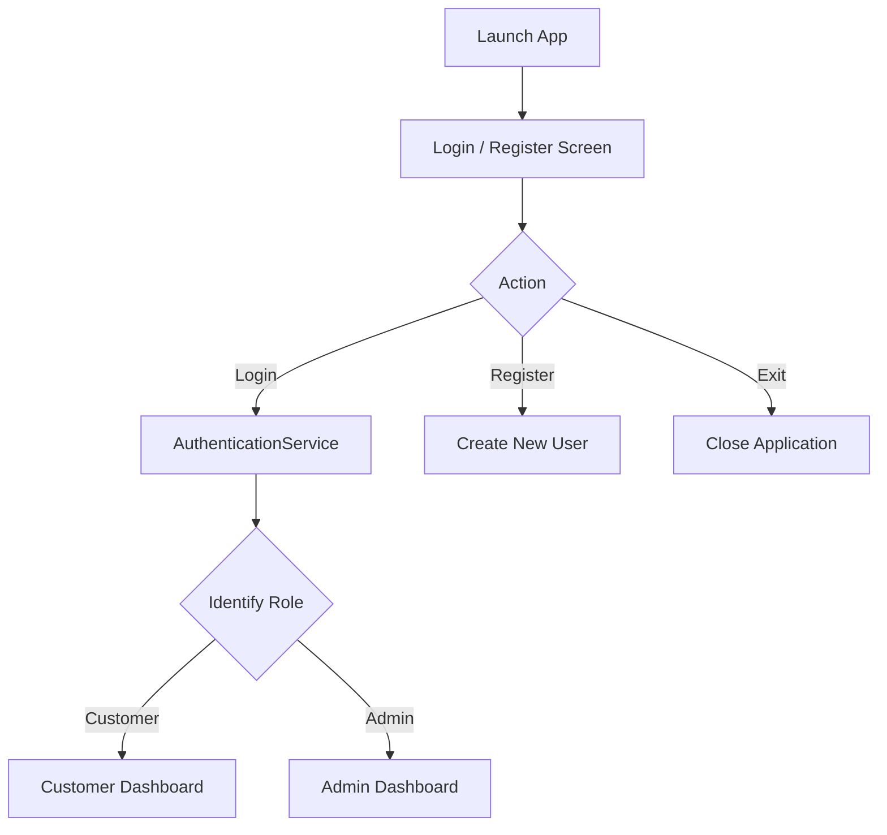
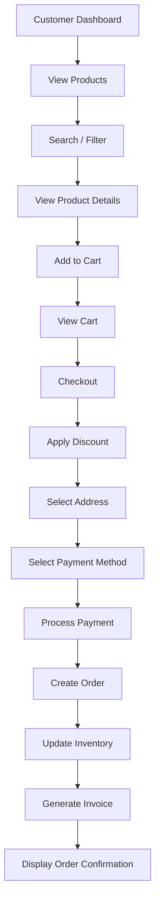
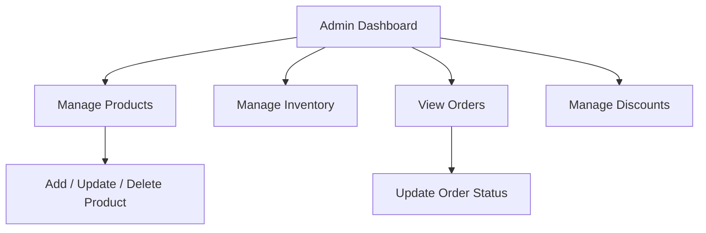

# 🛒 EcomFlow

### Smart E-Commerce Management System

**A Java OOP Course Project — demonstrating core Object-Oriented Programming principles through a modular, JavaFX e-commerce simulation with a custom CSS-styled UI.**


> 📌 **Core Purpose:** *To demonstrate how Object-Oriented Programming concepts in Java can be applied to design and implement a modular, real-world e-commerce management system.*
>
> EcomFlow is **not primarily an e-commerce product** — it is an academic vehicle for learning and showcasing Java OOP design. Every class, relationship, and workflow in this project exists to illustrate a specific OOP concept in a realistic context.

---

## 📖 About the Project

EcomFlow is a **JavaFX desktop application** that simulates the core operations of an online shopping platform. It allows **customers** to browse products, manage a shopping cart, and place orders, while **admins** manage products, inventory, categories, and order fulfillment.

The system is intentionally built using **layered architecture** and **classic OOP design patterns** (abstraction, inheritance hierarchies, interface-based polymorphism) so that each design decision maps back to a specific Java OOP concept — making it suitable for coursework, viva presentations, and portfolio demonstration.

---

## 🎯 Objectives

- Apply core Java OOP concepts to a realistic, multi-module domain problem.
- Design a clean, layered architecture separating **models**, **services**, **repositories**, and **UI**.
- Demonstrate **abstraction** and **polymorphism** through product and payment hierarchies.
- Practice **encapsulation** and **defensive validation** across all entity classes.
- Build a fully working **JavaFX desktop application**, styled with custom CSS, without relying on a database or any business/data framework.

---

## ✨ Features

> All features below are **implemented in Version 1 (JavaFX GUI, in-memory)** unless otherwise noted in [Future Enhancements](#-future-enhancements).

### Customer Features
- Register and log in
- Browse all products
- Search products by name/keyword
- Filter products by category
- View detailed product information
- Add / remove items from cart, update quantities
- View cart with live subtotal and total
- Apply a discount/coupon at checkout
- Select a payment method (UPI, Card, Cash on Delivery)
- Place an order and receive a generated invoice
- View order history and track order status
- Log out

### Admin Features
- Log in
- Add, update, delete products
- View and search all products
- Manage product categories
- Update inventory stock levels
- View all customer orders
- Update order status (e.g., PLACED → SHIPPED → DELIVERED)
- View registered customers
- Manage discount rules
- Log out

---

## 👥 User Roles

| Role | Description |
|------|-------------|
| **Customer** | End user who browses products, manages a cart, and places orders. |
| **Admin** | Manages the product catalog, inventory, categories, and order lifecycle. |

Both roles inherit from a common **`User`** base class, sharing authentication and profile behavior while overriding role-specific operations — a direct demonstration of **inheritance** and **method overriding**.

---

## 🏗️ System Architecture

EcomFlow follows a **layered, package-based architecture** that separates concerns between data models, business logic, and the JavaFX GUI.



**Layer responsibilities:**

| Layer | Responsibility |
|-------|-----------------|
| `gui` | JavaFX views/controllers and user interaction (calls services only, no business logic) |
| `service` | Business logic — validation, orchestration, workflows |
| `model` | Core entity classes (data + entity-level behavior) |
| `repository` | In-memory data storage using Java Collections |
| `interfaces` | Contracts implemented by payment and discount strategies |
| `payment` / `discount` | Concrete strategy implementations |
| `enums` | Fixed sets of constants (order status, payment status) |

### High-Level Class Relationships



---

## 📂 Project Structure

```
EcomFlow/
├── lib/
│   └── javafx-sdk-21.0.x/            # Downloaded JavaFX SDK — not written by us, see Installation & Setup
│
├── resources/                        # Everything the GUI loads at runtime (not compiled)
│   ├── css/
│   │   └── styles.css                # Single stylesheet for the whole app
│   └── images/
│       ├── logo.png
│       ├── icons/                    # Small UI icons (cart, logout, search, edit, delete...)
│       │   ├── cart.png
│       │   ├── logout.png
│       │   └── search.png
│       └── products/                 # Product images shown in cards/tables
│           ├── laptop.png
│           ├── smartphone.png
│           ├── tshirt.png
│           └── ...
│
├── src/
│   └── com/
│       └── ecomflow/
│           │
│           ├── Main.java                     # Application entry point — launches MainApp
│           │
│           ├── model/                        # Core entity classes
│           │   ├── User.java
│           │   ├── Customer.java
│           │   ├── Admin.java
│           │   ├── Product.java
│           │   ├── Electronics.java
│           │   ├── Clothing.java
│           │   ├── Grocery.java
│           │   ├── Category.java
│           │   ├── Cart.java
│           │   ├── CartItem.java
│           │   ├── Order.java
│           │   ├── OrderItem.java
│           │   ├── Address.java
│           │   └── Invoice.java
│           │
│           ├── interfaces/                   # Contracts / abstractions
│           │   ├── Payment.java
│           │   └── Discountable.java
│           │
│           ├── payment/                      # Payment strategy implementations
│           │   ├── UPIPayment.java
│           │   ├── CardPayment.java
│           │   └── CashOnDelivery.java
│           │
│           ├── discount/                     # Discount strategy implementations
│           │   ├── PercentageDiscount.java
│           │   ├── FlatDiscount.java
│           │   └── NoDiscount.java
│           │
│           ├── service/                      # Business logic layer
│           │   ├── AuthenticationService.java
│           │   ├── ProductService.java
│           │   ├── CustomerService.java
│           │   ├── AdminService.java
│           │   ├── CartService.java
│           │   ├── OrderService.java
│           │   ├── PaymentService.java
│           │   ├── InventoryService.java
│           │   └── DiscountService.java
│           │
│           ├── repository/                   # In-memory data storage
│           │   └── DataStore.java
│           │
│           ├── enums/                        # Fixed constant sets
│           │   ├── OrderStatus.java
│           │   └── PaymentStatus.java
│           │
│           └── gui/                          # JavaFX GUI layer
│               ├── MainApp.java              # extends javafx.application.Application
│               ├── LoginView.java
│               ├── RegisterView.java
│               ├── CustomerDashboardView.java
│               ├── AdminDashboardView.java
│               ├── ProductCard.java          # reusable image + details card component
│               └── GuiUtils.java             # shared alert/dialog/image-loading helpers
│
└── out/                               # Compiled .class files (generated, not committed)
```

**Why `resources/` sits outside `src/`:** CSS and image files aren't Java source, so they don't belong in the package tree — they're loaded at runtime as classpath resources (see Installation & Setup for the exact command).

📄 See [`ARCHITECTURE.md`](./ARCHITECTURE.md) for detailed module descriptions, package responsibilities, and additional sequence diagrams.

---

## 🧠 OOP Concepts Demonstrated

EcomFlow is built specifically to give every major Java OOP concept a concrete, working home in the codebase.

### 🔒 Encapsulation
All entity fields are declared `private`, exposed only through public getters/setters — protecting internal state from uncontrolled external access.

```java
public class Product {
    private double price;

    public double getPrice() { return price; }
    public void setPrice(double price) {
        if (price > 0) this.price = price;
    }
}
```

### 🧬 Inheritance
Two clear inheritance hierarchies drive the domain model:

```
User → Customer, Admin
Product → Electronics, Clothing, Grocery
```

`Customer` and `Admin` inherit shared identity/authentication behavior from `User`; `Electronics`, `Clothing`, and `Grocery` inherit shared pricing/stock behavior from `Product`.

### 🔁 Polymorphism

**Compile-time (Method Overloading):** multiple constructors/methods with different parameter lists (e.g., overloaded `Product` constructors for different subclass needs).

**Runtime (Method Overriding):** subclasses override abstract/parent behavior, and callers interact through the parent type.

```java
Payment payment = new UPIPayment();
payment.pay();   // resolved at runtime based on actual object type
```

### 🎭 Abstraction
`Product` is declared `abstract` with at least one abstract method, forcing every subclass to define its own discount logic:

```java
abstract class Product {
    abstract double calculateDiscount();
}
```

### 🔌 Interfaces
- **`Payment`** — implemented by `UPIPayment`, `CardPayment`, `CashOnDelivery`
- **`Discountable`** — implemented by `PercentageDiscount`, `FlatDiscount`, `NoDiscount`

Interfaces decouple *what* an operation does from *how* each strategy performs it.

### 🏗️ Constructors & Constructor Overloading
Entity classes provide both default and parameterized constructors, with overloading used where a class needs to be built from different sets of initial data.

### 🔑 `this` Keyword
Used consistently to disambiguate instance fields from constructor/method parameters:

```java
public Customer(String name, String email) {
    this.name = name;
    this.email = email;
}
```

### ⬆️ `super` Keyword
Used in subclasses to invoke parent constructors and reuse shared parent logic:

```java
public Customer(String name, String email, String password, String phone, Address address) {
    super(name, email, password, phone);
    this.address = address;
}
```

### 📌 Static Members
Shared, class-level data is modeled with static fields/methods:

```java
public class User {
    private static int userCount = 0;
}
```

Used for the application name constant, and running counters for users, products, and orders.

### 🔓 Access Modifiers
| Modifier | Usage in EcomFlow |
|----------|--------------------|
| `private` | Entity fields (encapsulation) |
| `public` | Getters/setters, service methods, class declarations |
| `protected` | Fields/methods intended for subclass access (e.g., shared `User` internals) |
| *default (package-private)* | Internal helper classes/methods used only within the same package |

### ⬆️⬇️ Upcasting & Downcasting
Payment and discount strategies are referenced via their interface type (**upcasting**) and, where strategy-specific behavior is needed, cast back to the concrete type (**downcasting**):

```java
Payment payment = new CardPayment();     // Upcasting
if (payment instanceof CardPayment cp) { // Downcasting (pattern variable)
    cp.showCardSpecificDetails();
}
```

---

## 🔄 Application Workflow

### Main Flow



### Customer Flow



### Admin Flow



---

## 🛠️ Technology Stack

| Category | Technology |
|-----------|-------------|
| Language | Java |
| Version | Java 17+ (recommended) |
| Paradigm | Object-Oriented Programming |
| Data Storage | In-memory (Java Collections Framework) |
| Interface | JavaFX GUI, styled with custom CSS |
| Styling | JavaFX CSS (`resources/css/styles.css`) |
| Build | Manual compilation via `javac`/`java` with the JavaFX SDK on the module path (no Maven/Gradle required) |
| External Frameworks | JavaFX SDK only (UI toolkit, downloaded separately since Java 11) — no other frameworks |

---

## 📦 Java Concepts Used

- Classes & Objects
- Encapsulation
- Inheritance (single-level, multi-class hierarchies)
- Polymorphism (compile-time & runtime)
- Abstraction (abstract classes & methods)
- Interfaces (multiple interface implementation)
- Constructors & Constructor Overloading
- Method Overloading & Method Overriding
- Static Variables, Methods, and Blocks
- Access Modifiers (`public`, `private`, `protected`, default)
- `this` and `super` keywords
- Upcasting & Downcasting
- Exception Handling (`try` / `catch` / `finally` / `throw` / `throws`, custom exceptions)
- Java Collections Framework (`ArrayList`, `HashMap`, `HashSet`)
- Enums (`OrderStatus`, `PaymentStatus`)

---

## 🎨 JavaFX UI Design

`MainApp` (extends `javafx.application.Application`) owns a single `Stage` and swaps its root `Node` between screens — the JavaFX equivalent of `CardLayout`, but with each screen free to use whatever layout (`BorderPane`, `GridPane`, `FlowPane`, `HBox`/`VBox`) fits it best. Every screen loads the same `styles.css` stylesheet, so the whole app shares one consistent visual language instead of each screen inventing its own look.

### Visual Design System (`resources/css/styles.css`)

| Token | Value | Used for |
|-------|-------|----------|
| `--color-primary` | `#2E7D32` (deep green) | Primary buttons, active nav item, price highlights |
| `--color-primary-dark` | `#1B5E20` | Button hover/pressed states |
| `--color-accent` | `#FF7043` (warm orange) | "Add to Cart" / call-to-action buttons |
| `--color-bg` | `#F7F8FA` (soft off-white) | Screen backgrounds |
| `--color-surface` | `#FFFFFF` | Cards, panels, dialogs |
| `--color-text` | `#1C1C1C` | Primary text |
| `--color-text-muted` | `#6B7280` | Secondary text, captions |
| `--radius-card` | `12px` | Product cards, buttons, input fields |
| Font | `"Segoe UI", Inter, sans-serif` | Headings and body text |

> JavaFX CSS doesn't support real CSS custom properties (`var()`) — the table above documents the palette by name; in `styles.css` each value is simply repeated wherever it's used, or defined once as a `-fx-*` looked-up color on the root node.

**Design principles applied:**
- Generous white space and card-based layout instead of dense forms/tables everywhere
- Soft drop shadows (`-fx-effect: dropshadow(...)`) on cards and dialogs for depth
- Rounded corners (`-fx-background-radius`) on buttons, cards, and input fields
- Hover and pressed states on every clickable element (`:hover`, `:pressed` pseudo-classes)
- Product images given equal, fixed-size treatment (`ImageView` with `setPreserveRatio(true)` and a clipped fixed frame) so the catalog grid stays visually even even when source images vary in size

### Screens

**Login / Register** — centered card over the `--color-bg` background, app logo (`resources/images/logo.png`) above the form, primary-colored submit button with a hover-darken effect.

**Customer Dashboard** — left-hand navigation rail (Browse, Cart, Orders, Profile) built with a `VBox`; main content area on the right:
- *Browse Products* — a responsive `FlowPane`/`GridPane` grid of `ProductCard` components, each showing the product image (from `resources/images/products/`), name, price, category badge, and an "Add to Cart" button; a search field and category filter sit above the grid
- *Cart* — list of items with thumbnail, quantity spinner, remove button, and a live-updating total in the accent color
- *Checkout* — coupon field, address form, payment method as styled radio/segmented buttons, and a generated invoice card
- *Order History* — a styled table/list with a colored status chip per row (color varies by `OrderStatus`)
- *Profile* — read/edit account details in a card layout

**Admin Dashboard** — same navigation-rail shell, different sections:
- *Products* — add/update/delete forms in a dialog or side panel, backed by a `TableView` with thumbnail, name, price, and stock columns
- *Inventory* — quick stock adjustment controls per product
- *Orders* — `TableView` with a status dropdown (`ComboBox<OrderStatus>`) per row, enforcing the same lifecycle rules as the service layer
- *Customers* — read-only `TableView` of registered customers

---

## 🚀 Installation & Setup

### Why an extra step vs. plain Java
Up to Java 8, JavaFX shipped bundled inside the JDK. **From Java 11 onward, JavaFX is a separate SDK** that Oracle/Gluon distribute independently — this is a normal, well-documented requirement for any JavaFX project on a modern JDK, not something specific to EcomFlow. You only need to download and point to it once.

### Prerequisites
- Java Development Kit (JDK) **17 or higher**, installed and available on your `PATH`
- The **JavaFX SDK** (a separate download — see below)
- Git (to clone the repository)

### 1. Clone the repository
```bash
git clone https://github.com/<your-username>/ecomflow.git
cd ecomflow
```

### 2. Download the JavaFX SDK
1. Go to [gluonhq.com/products/javafx](https://gluonhq.com/products/javafx/) and download the **SDK** (not "jmods") for your OS, matching your JDK version (JavaFX 21 pairs well with JDK 17+).
2. Unzip it and place the folder inside the project as `lib/javafx-sdk-21.0.x/` (matching the Project Structure above), or anywhere convenient on your machine — you'll reference its `lib` subfolder in the commands/config below.

### 3. Verify Java is installed
```bash
java -version
javac -version
```

### 4. Compile the project

JavaFX classes live on the **module path**, not the regular classpath, so both `javac` and `java` need a `--module-path` pointing at the JavaFX SDK's `lib` folder, plus `--add-modules` naming the JavaFX modules used.

```bash
javac --module-path lib/javafx-sdk-21.0.x/lib --add-modules javafx.controls,javafx.fxml \
      -d out $(find src -name "*.java")
```

> `javafx.fxml` is only needed if you use FXML layout files; if you build every screen purely in Java code (as the default plan in `PHASES.md` does), you can drop it: `--add-modules javafx.controls`.

### 5. Run the application

The `resources/` folder (CSS + images) also needs to be on the classpath so `getResource(...)` calls in the GUI code can find them:

```bash
java --module-path lib/javafx-sdk-21.0.x/lib --add-modules javafx.controls \
     -cp "out:resources" com.ecomflow.Main
```

On Windows (PowerShell/cmd), use a semicolon instead of a colon in `-cp`:
```powershell
java --module-path lib\javafx-sdk-21.0.x\lib --add-modules javafx.controls -cp "out;resources" com.ecomflow.Main
```

### IDE setup (recommended over raw terminal commands)

Typing the module-path flags by hand every time gets old fast — most people configure their IDE once instead:

**IntelliJ IDEA**
1. `File → Project Structure → Libraries → +` and add the JavaFX SDK's `lib` folder as a library.
2. `Run → Edit Configurations` on your `Main` run configuration, add to **VM options**:
   `--module-path "lib/javafx-sdk-21.0.x/lib" --add-modules javafx.controls`
3. Mark the `resources` folder as a **Resources Root** (right-click → Mark Directory as) so it's automatically on the runtime classpath.

**Eclipse**
1. Install the **e(fx)clipse** plugin from the Eclipse Marketplace (adds JavaFX project support and a UI builder).
2. Right-click project → `Build Path → Configure Build Path → Libraries → Add External JARs`, add all `.jar` files from the JavaFX SDK's `lib` folder.
3. In the Run Configuration's **Arguments → VM arguments**, add the same `--module-path`/`--add-modules` flags as above.

**VS Code**
1. Install the **Extension Pack for Java** and the **JavaFX Support** extension.
2. In `.vscode/settings.json`, add the JavaFX SDK's `lib` folder to `java.project.referencedLibraries`.
3. In `.vscode/launch.json`, add `"vmArgs": "--module-path lib/javafx-sdk-21.0.x/lib --add-modules javafx.controls"` to the launch configuration for `Main`.

---

## ▶️ How to Use

### As a Customer
1. Choose **Register** to create an account, or **Login** with existing/demo credentials.
2. From the Customer Dashboard, browse or search products.
3. Add desired products to your cart and adjust quantities.
4. Proceed to **Checkout**, apply a discount code if available, choose a shipping address, and select a payment method.
5. Confirm the order to receive a generated invoice and order confirmation.
6. Visit **Order History** at any time to view past orders and track status.

### As an Admin
1. Log in with admin credentials.
2. Use **Add / Update / Delete Product** to manage the catalog.
3. Use **Manage Inventory** to adjust stock levels.
4. Use **View Orders** and **Update Order Status** to progress orders through their lifecycle (`PLACED → CONFIRMED → PACKED → SHIPPED → OUT_FOR_DELIVERY → DELIVERED`).
5. Use **Manage Discounts** to configure available discount strategies.

---

## 🧪 Sample Credentials

> ⚠️ These are **demo credentials for local testing only** — no real passwords or sensitive data are stored or transmitted.

| Role | Name | Email | Password |
|------|------|-------|----------|
| Admin | System Administrator | `admin@ecomflow.com` | `adminPass` |
| Customer | Alice Johnson | `alice@ecomflow.com` | `pass123` |
| Customer | Bob Smith | `bob@ecomflow.com` | `pass456` |

> 💡 Use the **"Customer Demo"** / **"Admin Demo"** quick-fill buttons on the Login screen to populate credentials instantly.

### Sample Product Catalog

| Category | Sample Products |
|-----------|------------------|
| Electronics | Laptop, Smartphone, Headphones |
| Clothing | T-Shirt, Jeans, Jacket |
| Grocery | Rice, Milk, Coffee |

---

## 📸 Screenshots

<!-- Add screenshot here -->
<!-- Example:  -->

<!-- Add screenshot here -->
<!-- Example:  -->

<!-- Add screenshot here -->
<!-- Example:  -->

---

## 🧪 Testing

Version 1 of EcomFlow relies on **manual, GUI-driven testing**:

- Each service (`AuthenticationService`, `CartService`, `OrderService`, etc.) is exercised through the JavaFX screens, covering both valid and invalid inputs.
- Validation rules (e.g., empty cart checkout, negative stock, insufficient stock, invalid login) are manually verified against the [Validation Rules](#validation-rules) below.
- Edge cases such as cancelling a delivered order or applying an invalid discount are tested to confirm the correct custom exception is thrown and handled gracefully.

> Automated unit testing (e.g., JUnit) is noted as a future enhancement.

### Validation Rules

- Product price must be greater than 0.
- Product quantity cannot be negative.
- Email and password fields cannot be empty.
- Product name cannot be empty.
- Cannot add an unavailable product to the cart.
- Cannot order a quantity greater than available stock.
- Cannot checkout an empty cart.
- Cannot cancel a delivered order.
- Cannot apply an invalid discount code.
- Pincode must pass basic format validation.

### Exception Handling

Custom exceptions are used to represent domain-specific failure cases, handled using `try` / `catch` / `finally` / `throw` / `throws`:

- `InvalidLoginException`
- `ProductNotFoundException`
- `InsufficientStockException`
- `EmptyCartException`
- `InvalidPaymentException`

---

## 🔮 Future Enhancements

The following are **not implemented in Version 1** and are listed purely as potential future directions:

- Persistent database storage (PostgreSQL / MySQL) via JDBC
- REST API layer using Spring Boot
- Web frontend (e.g., React)
- JWT-based authentication
- Real payment gateway integration
- Email notifications
- Product recommendation system
- AI-powered shopping assistant / chatbot
- Cloud deployment
- Docker containerization
- Admin analytics dashboard
- Persistent user accounts across sessions

---

## 📚 Learning Outcomes

By completing EcomFlow, this project demonstrates practical understanding of:

- Core Java syntax and program structure
- Designing classes, objects, and their relationships
- Encapsulation for safe, controlled data access
- Inheritance for modeling shared behavior across related entities
- Polymorphism (compile-time and runtime) for flexible, extensible behavior
- Abstraction for defining contracts without dictating implementation
- Interfaces for decoupled, strategy-based design (payments, discounts)
- Constructors, `this`, and `super` for proper object initialization
- Access modifiers for controlling visibility and encapsulation boundaries
- Static members for shared, class-level state
- Exception handling for robust, predictable failure modes
- Java Collections (`ArrayList`, `HashMap`, `HashSet`) for in-memory data management
- Modular, layered software architecture

---

## 👨‍💻 OOP Concepts Summary

| Concept | Where It's Used |
|----------|------------------|
| Encapsulation | Private fields + getters/setters in every model class |
| Inheritance | `User → Customer, Admin` · `Product → Electronics, Clothing, Grocery` |
| Polymorphism | `Payment`/`Discountable` implementations, overridden `calculateDiscount()` |
| Abstraction | Abstract `Product` class with abstract `calculateDiscount()` |
| Interfaces | `Payment`, `Discountable` |
| Constructors | Default & parameterized constructors across all models |
| Constructor Overloading | `Product` and subclass constructors |
| Method Overloading | Service-layer utility methods with varying parameters |
| Method Overriding | `displayDetails()`, `calculateDiscount()`, `pay()`, role-specific `User` methods |
| Static Members | Application name constant, `userCount`, `productCount`, `orderCount` |
| Access Modifiers | `private`, `protected`, `public`, default — across models and services |
| `this` Keyword | Constructor parameter disambiguation |
| `super` Keyword | Subclass constructors calling parent (`User`, `Product`) constructors |
| Upcasting / Downcasting | `Payment payment = new UPIPayment();` and safe casts back to concrete types |

---

## 🤝 Contribution

This is an academic/portfolio project. Suggestions and improvements are welcome:

1. Fork the repository
2. Create a feature branch (`git checkout -b feature/your-feature`)
3. Commit your changes
4. Open a pull request describing the change

---

## 📄 License

This project is released under the [MIT License](./LICENSE) — free to use for learning and portfolio purposes.

---

<p align="center">Built with ☕ Java and a focus on solid Object-Oriented Design.</p>
